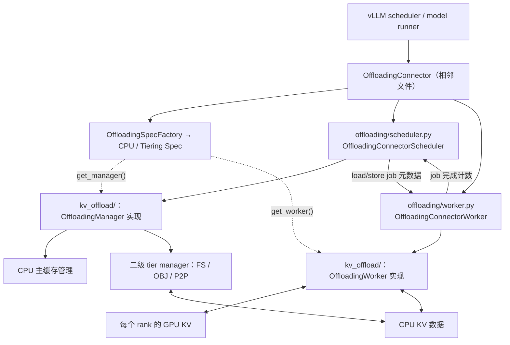
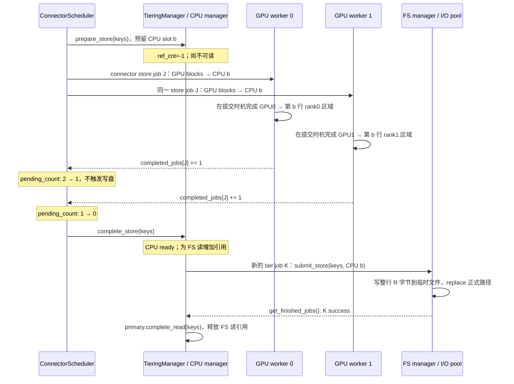
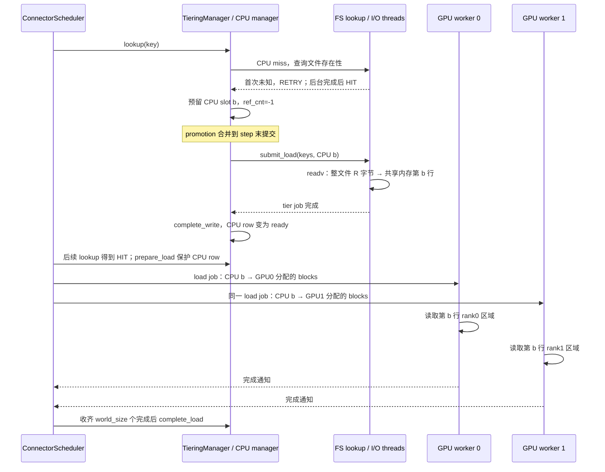

# KV offloading 两个目录的代码结构与 TP / 文件系统执行路径

本文基于本地源码 HEAD `55a078a09`（2026-09-06）整理。范围是两个目录下全部 Python 文件，并补充相邻入口 `offloading_connector.py`。这是源码阅读笔记，示例用于解释当前实现，没有运行 GPU/TP 端到端验证。文中“实现限制”来自分支、断言或实际数据流；“部署前提/推论”会单独标明。

## 1. 两个目录的关系

| 目录 | 目标 | 它理解的主要对象 |
| --- | --- | --- |
| `vllm/distributed/kv_transfer/kv_connector/v1/offloading/` | 把 KV offloading 接入引擎调度和模型执行周期 | Request、token 数、GPU block、KV cache group、抢占、connector metadata、各 worker 完成通知 |
| `vllm/v1/kv_offload/` | 提供缓存管理抽象、CPU 搬运实现和二级存储后端 | OffloadKey、CPU 槽位、引用计数、淘汰策略、共享内存、文件/对象/网络 I/O |

它们是“引擎适配与编排层 → 卸载机制与后端层”。两个目录都涉及 scheduler 和 worker；不能按目录把前者理解成 scheduler、后者理解成 GPU worker。虽然存在少量指标类型的反向引用，主要执行依赖仍是前者调用后者。



**运行位置：**ConnectorScheduler、OffloadingManager、TieringOffloadingManager 和二级 tier manager 在 scheduler 进程中；ConnectorWorker 与 CPUOffloadingWorker 在各 GPU worker 进程中。FS manager 另外创建后台 lookup 线程与 I/O 线程池，这些线程仍属于 scheduler 进程。

## 2. `offloading/`：逐文件说明

目录共有 6 个文件：

```text
vllm/distributed/kv_transfer/kv_connector/v1/
├── offloading_connector.py       # 相邻入口，补充说明
└── offloading/
    ├── __init__.py
    ├── common.py
    ├── scheduler.py
    ├── worker.py
    ├── events.py
    └── metrics.py
```

### 2.1 相邻入口：`offloading_connector.py`

- **目标：**实现 `KVConnectorBase_V1`，为引擎暴露统一 connector 接口，声明 `SupportsHMA`。
- **执行逻辑：**构造时用 `OffloadingSpecFactory.create_spec()` 选择后端；按 `KVConnectorRole.SCHEDULER/WORKER` 创建对应适配对象。scheduler 回调转发给 ConnectorScheduler；KV tensor 注册、传输启动、抢占处理和完成轮询转发给 ConnectorWorker。
- **使用限制：**这是 block 级卸载。`save_kv_layer()`、`wait_for_layer_load()`、`wait_for_save()` 在这里为空实现；不要据此推断有逐层保存/等待能力。普通 store 的延迟提交在 `get_finished()` 路径安排，即使没有 forward 也需要执行。

### 2.2 `__init__.py`

- **目标：**标识 Python 包。
- **执行逻辑：**空文件。
- **使用限制：**没有自动注册或初始化后端的副作用；注册发生在 factory 文件。

### 2.3 `common.py`

- **目标：**定义跨 scheduler/worker 的任务协议和传输统计。
- **执行逻辑：**`TransferJob` 包含 `req_id`、`src_spec`、`dst_spec`；`OffloadingConnectorMetadata` 携带 `load_jobs`、`store_jobs`、`jobs_to_flush`。worker 通过 `OffloadingWorkerMetadata.completed_jobs` 返回 `{job_id: 1}`；`aggregate()` 把各 worker 的同一 job 计数相加。方向统计记录 bytes、time、size 样本。
- **使用限制：**这里传递的是位置和状态元数据，KV 字节不随消息发送。完成计数可能跨多个 step 收齐；不能把某一个 rank 的完成当成整个 job 完成。

### 2.4 `scheduler.py`

- **目标：**把请求级缓存复用和生命周期转换为安全的 block 搬运计划。
- **执行逻辑：**
  1. `SchedulerOffloadConfig.from_spec()` 解析各 group 的块大小、窗口、对齐规则，`num_workers` 取 `parallel_config.world_size`。
  2. `on_new_request()` 建立请求状态，向 manager 询问 block-level/request-level 卸载策略。
  3. `get_num_new_matched_tokens()` / `_lookup()` 根据请求 hash 查询 manager；结合 full attention、滑动窗口、Mamba 对齐与 GPU 已命中前缀，计算额外可复用 token。
  4. `update_state_after_alloc()` 在 GPU 分配完 block 后调用 `prepare_load()`，把 CPU 来源与 GPU 目标封装为 job。
  5. `_build_store_jobs()` 选择可保存的完整块，调用 `prepare_store()` 取得 CPU 槽位，并记录仍引用 GPU block 的 store。
  6. `build_connector_meta()` 汇总任务、待 flush 的 job，并调用 manager 的 `on_schedule_end()` 推动异步 tier 工作。
  7. `update_connector_output()` 累减 job 的 `pending_count`，为零后才调用 `complete_store()` / `complete_load()`。
  8. 请求结束、抢占和 GPU block 复用时保留必要的传输状态；`reset_cache()` 用 stale job 阈值忽略旧完成通知。
- **使用限制：**只对满足块边界与模型布局要求的数据生成任务；默认仅卸载 prompt 块，尾部不足整块的数据不能假设已保存。请求结束不等于 store 已完成。异步 lookup 的 `RETRY` 与已有数据仍写入中的 `HIT_PENDING` 都不能直接作为可读命中。GPU block 被重新使用前必须完成相关 flush。

### 2.5 `worker.py`

- **目标：**对接实际 KV tensor 布局和引擎时序，驱动后端 worker。
- **执行逻辑：**`register_kv_caches()` 识别 attention/Mamba 等布局，处理共享 tensor、packed allocation，转换成 `CanonicalKVCaches` 后调用 `spec.get_worker()`。跨层缓存有单独注册路径。`start_kv_transfers()` 先提交上一轮延迟的 store，再提交本轮 load。`prepare_store_kv()` 把 store 留到下一轮开头。`handle_preemptions()` 提交待处理 store，并等待 `jobs_to_flush`。`get_finished()` 轮询底层传输，汇总 job 完成和接收完成的请求 ID。
- **使用限制：**跨层注册要求单一 KV group、block 为物理首维、storage offset 为 0 等条件。未覆盖的缓存规格会抛出 `NotImplementedError`。目前提交失败和传输失败以断言处理，没有通用 GPU 传输失败恢复。store 不通过 `finished_sending` 汇报请求级结束，而由 job 完成计数和 GPU block flush 保证安全。

### 2.6 `events.py`

- **目标：**把 manager 的 `OffloadingEvent` 转成对外 `BlockStored` / `BlockRemoved`。
- **执行逻辑：**`OffloadingEventsTracker` 按开关记录保存时的 hash、token、parent、group 等辅助信息；事件到来时补全自描述 payload，或生成兼容的占位 payload；reset 清理侧表。
- **使用限制：**必须开启全局 KV cache events；自描述模式还需显式 opt-in。自描述信息适用于支持的 full-attention group，其他路径保留占位回退；`TieringOffloadingSpec` 明确拒绝开启自描述模式，因为 promotion 产生的 CPU store 事件不一定对应原始 GPU store job。

### 2.7 `metrics.py`

- **目标：**提供 connector、CPU manager 和二级 tier 可共用的统计聚合与 Prometheus 导出。
- **执行逻辑：**声明传输/查询指标；`OffloadingConnectorStats` 记录 counter、gauge、histogram，跨结果聚合并生成日志摘要；`OffloadPromMetrics` 合并 connector 与所选 spec/tier 的指标定义，创建和更新 Prometheus 指标，并维护兼容指标。
- **使用限制：**指标名、类型、标签必须与声明一致，未知类型/键会断言。传输 time 是各传输观测值的累计，不能直接当成整个请求的墙钟延迟；CPU usage 指标表示传输占用、不可淘汰的空间比例，不能当成所有已缓存 KV 的占用率。

## 3. `kv_offload/`：目录总览

```text
vllm/v1/kv_offload/
├── __init__.py
├── base.py
├── factory.py
├── file_mapper.py
├── cpu/
│   ├── __init__.py
│   ├── common.py
│   ├── spec.py
│   ├── manager.py
│   ├── gpu_worker.py
│   ├── shared_offload_region.py
│   ├── swap_blocks_triton.py
│   └── policies/
│       ├── __init__.py
│       ├── base.py
│       ├── lru.py
│       └── arc.py
└── tiering/
    ├── __init__.py
    ├── base.py
    ├── factory.py
    ├── spec.py
    ├── manager.py
    ├── async_lookup.py
    ├── example/
    │   ├── __init__.py
    │   └── manager.py
    ├── fs/
    │   ├── __init__.py
    │   ├── manager.py
    │   ├── io.py
    │   └── thread_pool.py
    ├── obj/
    │   ├── __init__.py
    │   ├── config.py
    │   └── manager.py
    └── p2p/
        ├── __init__.py
        ├── manager.py
        ├── control/
        │   ├── __init__.py
        │   ├── base.py
        │   └── zmq.py
        ├── data/
        │   ├── __init__.py
        │   ├── base.py
        │   └── nixl.py
        └── session/
            ├── __init__.py
            ├── protocol.py
            ├── session.py
            ├── client.py
            └── server.py
```

### 3.1 根目录：抽象与选择

| 文件 | 目标与主要执行逻辑 | 使用限制 |
| --- | --- | --- |
| `__init__.py` | 空包入口。 | 无运行逻辑。 |
| `base.py` | `OffloadKey` 把 block hash 与 4 字节 group index 拼接；定义请求上下文、四态 lookup、load/store spec、canonical KV tensor、传输结果、指标元数据。`OffloadingManager` 管缓存状态，`OffloadingWorker` 执行 GPU↔某个卸载介质，`OffloadingSpec` 组装二者并计算块大小。 | API 显式标为 experimental。GPU block 必须能按 hash block 整分；显式指定 offload `block_size` 时要求各 GPU group 块大小相同，且为其整数倍。`prepare_*` 与 `complete_*` 必须配对；请求结束回调不代表数据已持久化。 |
| `factory.py` | 延迟注册/加载 `CPUOffloadingSpec` 与 `TieringOffloadingSpec`；默认 CPU；未注册名称可由 `spec_module_path` 导入。 | 自定义类必须继承 `OffloadingSpec`；重复注册、无模块的未知类型会失败。 |
| `file_mapper.py` | 将模型、块大小、dtype、KV groups、并行配置等字段转成 JSON 后求 SHA256 前缀，生成命名空间；由 hash 与 group 生成文件名，并提供 `config.json` 路径。 | 不执行 I/O、重排或校验 KV 字节。`parallel_agnostic` 仅在单一、非 MLA 的 FullAttentionSpec 且非 V2 runner 时生效；详见第 7 节。配置命名空间不等于完整模型权重内容校验。 |

### 3.2 `cpu/`：CPU 主缓存与 GPU 搬运

| 文件 | 目标与主要执行逻辑 | 使用限制 |
| --- | --- | --- |
| `cpu/__init__.py` | 空包入口。 | 无运行逻辑。 |
| `cpu/common.py` | 定义 `CPULoadStoreSpec`（CPU block ID 数组）和 CPU 指标名称。 | CPU ID 是物理缓存槽位，不是请求的 token 下标，也不是持久文件中的永久 ID。 |
| `cpu/spec.py` | 从 GPU KV 分配大小、`world_size` 和 `block_size_factor` 计算单 rank 槽位字节数、整块字节数和 CPU 块数；创建 `CPUOffloadingManager` / `CPUOffloadingWorker`；声明 CPU 指标。 | 必须设置 `cpu_bytes_to_use`；预算是全部 workers 合计，非每 rank 一份。worker 平台检查仅接受 CUDA-alike 或 XPU。LRU/ARC 是 CPU 淘汰策略；`store_threshold >= 2` 是单层 CPU 的复用次数过滤功能。 |
| `cpu/manager.py` | 保存 key→BlockStatus，分配/回收槽位；lookup 返回 MISS/HIT/HIT_PENDING；prepare_load 增加读引用；prepare_store 去重、可选热度过滤、必要时淘汰并预留写入；complete_store 成功标记 ready，失败清理未就绪块；收集事件/指标。 | 只管理位置和状态，不复制 tensor。空间不足且无足够可淘汰块时返回 None。写入中或被读引用的块不可淘汰。调用方必须保证 ready 后再 load。 |
| `cpu/gpu_worker.py` | 将 canonical GPU tensor 视为二维 int8 页；普通 CPU 模式分配独立 CPU tensor，tiering 模式从 mmap 取 strided view；两个 `SingleDirectionOffloadingHandler` 分别处理 store/load，构造源/目标指针、处理大块子块偏移，借助 stream/event 异步执行并回收描述符缓冲。 | GPU→CPU 选择 C++ `ops.swap_blocks_batch`；CPU→GPU 仅在 Triton 可用、非 XPU、payload 较小且 8 字节对齐等条件下用 Triton，其余走 C++。tensor 形状、设备、group 和页大小受断言约束。共享 mmap 的 host registration 仅在 CUDA-alike 执行，注册失败记录告警。 |
| `cpu/shared_offload_region.py` | 创建/打开 `/dev/shm/vllm_offload_{engine_id}.mmap`；O_EXCL 选出创建者，ftruncate 后其他进程等待大小到位；MAP_SHARED 映射；rank worker 取得本 rank 的跨 block strided view，scheduler 取得整个二维 memoryview；清理时释放注册和映射，创建者 unlink。 | 依赖 Linux 风格 `/dev/shm`、共享映射与 `MADV_POPULATE_WRITE`；后者要求内核支持。所有参与者必须访问同一个底层共享内存文件且同意布局；非网络共享内存。整行需按 mmap page 对齐，rank 子区域禁止越界。详见第 5 节。 |
| `cpu/swap_blocks_triton.py` | 按批量源/目标地址、大小描述符启动 Triton kernel，把字节块分 chunk 搬运；少于 16 个描述符时回退到 C++ 路径。 | 只做复制；不管理缓存或 job 生命周期。由上层选择符合对齐、平台和 CPU 指针可访问条件的路径；调优常量源于 H100，不能当作所有硬件的性能结论。 |

### 3.3 `cpu/policies/`：淘汰策略

| 文件 | 目标与主要执行逻辑 | 使用限制 |
| --- | --- | --- |
| `cpu/policies/__init__.py` | 空包入口。 | 无运行逻辑。 |
| `cpu/policies/base.py` | `BlockStatus` 用 ctypes 存 CPU slot 与 ref_cnt；定义 `CachePolicy` 的 get/insert/remove/touch/evict/clear 等契约。 | ref_cnt=-1 表示未就绪，0 表示可淘汰，正数表示读传输占用。evict(n) 必须要么完成 n 个淘汰，要么返回 None 且不改状态。 |
| `cpu/policies/lru.py` | 全量 blocks 字典加专门的 evictable OrderedDict；touch/完成更新近期顺序；淘汰时跳过 protected keys，先选齐再删除。 | 活跃块不在可淘汰链表中；LRU 最近性取决于显式 touch 和完成通知，不是每次 get 自动更新。 |
| `cpu/policies/arc.py` | T1 存近期块，T2 存频繁块，B1/B2 记录已淘汰 key；touch 根据 ghost 命中调整目标 T1 大小；淘汰先模拟选齐候选再修改状态。 | ghost 只有历史 key，没有 KV 数据；仍只能淘汰 ref_cnt=0 且未保护的块，找不到足够候选会返回 None。 |

### 3.4 `tiering/`：多层编排

| 文件 | 目标与主要执行逻辑 | 使用限制 |
| --- | --- | --- |
| `tiering/__init__.py` | 空包入口。 | 无运行逻辑。 |
| `tiering/base.py` | 定义 `JobMetadata`（keys、CPU block_ids、promotion 方向、请求上下文）、`JobResult`、`SecondaryTierManager` 和允许下层访问上层的 `ParentManager`。二级 tier 接收整个 CPU memoryview。 | 二级 tier 只在 CPU 与自身介质间传输，不直接访问 GPU。异步任务完成前不得回报成功或继续使用已释放槽位；reset 前 `drain_jobs()` 必须使 I/O 真正停止访问主缓存。 |
| `tiering/factory.py` | 根据 `secondary_tiers[].type` 构造实现，并传入 spec、primary view 和该 tier 的其余配置；延迟注册 example/fs/p2p/obj/local_engine。 | 必须给出已注册 type。`local_engine` 指向目录外的 `prefix_aware_cache` 包，安装与实现不在本文两目录内。 |
| `tiering/spec.py` | 继承 CPU spec，把整块对齐到系统页；scheduler 用 rank=None 创建共享区、CPUPrimaryTier manager 和各 secondary manager；worker 用设备索引模 world_size 选择共享区槽位并创建 CPU worker。 | 明确拒绝 `self_describing_kv_events=True` 和 `store_threshold >= 2`；secondary_tiers 必须为 list。共享区按 engine_id 隔离；GPU↔CPU 之外的传输由 secondary managers 执行，没有为每个 tier 新建 GPU worker。 |
| `tiering/manager.py` | `CPUPrimaryTierOffloadingManager` 给 CPU manager 增加共享内存视图与 read/write 别名。`TieringOffloadingManager` 先查 CPU，再按配置顺序查 secondary；命中后二级→CPU promotion 按 tier/request 合批。GPU→CPU 完成后向所有 secondary cascade。轮询二级任务以 complete_read/complete_write 管理引用；延迟请求 finalization；reset 先 drain 后重置主缓存。 | secondary 列表是多个并列后端，不是 CPU→FS→OBJ 串联。CPU 无空间可 promotion 时返回 MISS。reset 保留二级持久数据；请求结束不等于写盘结束。BLOCK_LEVEL/REQUEST_LEVEL 策略影响是否把已有前缀也提交给特定 tier。 |
| `tiering/async_lookup.py` | scheduler 线程维护 key 状态与请求反向索引；lookup 先返回未知，step 末 flush 到后台线程按请求批量查存在性；结果通过线程安全队列回传；请求结束清理无人引用的查询状态。 | batch_lookup 必须同步返回与 keys 对应的布尔序列，不能访问 scheduler/primary 状态；调用方需持续驱动 flush 和结果处理。存在性结果是查询时的快照，不保证稍后的 load 一定成功。 |

### 3.5 `tiering/fs/`：本地文件系统

| 文件 | 目标与主要执行逻辑 | 使用限制 |
| --- | --- | --- |
| `tiering/fs/__init__.py` | 空包入口。 | 无运行逻辑。 |
| `tiering/fs/manager.py` | 构造 FileMapper、写入配置文件、创建存在性查询线程和双队列 I/O 池。lookup 通过可选 C 批量查询或 os.path.exists 异步执行。submit_store/load 为每个 key 生成一个整行 I/O task，汇总成 JobResult；可选发布成功写入事件。 | 管理器在 scheduler 进程中；一个文件写全部 rank 的一行。没有磁盘容量预算或 LRU/TTL 清理。跨进程复用需稳定的 hash seed；代码文档要求实例使用一致的固定 PYTHONHASHSEED。事件需全局与 tier 两级开关。 |
| `tiering/fs/io.py` | store：若正式文件存在则跳过，否则切出 CPU 字节范围，写随机线程后缀临时文件，检查短写，os.replace 发布；失败清理临时文件。load：os.readv 直接读入目标 memoryview，检查短读。 | Linux 使用 O_DIRECT；文件系统需支持相应 I/O 和地址/长度对齐，失败没有自动去掉 O_DIRECT 重试。读失败会尝试删除源文件。没有内容 checksum，没有 fsync 文件/目录；原子发布不等于断电持久性保证。已存在文件跳过写入也不会检查内容。 |
| `tiering/fs/thread_pool.py` | 两队列分别保存 load/store block task，两组线程各自优先服务一种、空时处理另一种；JobState 汇总任务数量及成功状态；get_finished 取完成 job；wait_idle 等全部任务完成。 | 默认由 FS manager 创建 16 读+16 写线程，与 TP rank 数无对应关系。至少要有可工作的线程；任务数应与实际 task 数相符且非空。shutdown 会清空排队任务，不能用它代替先 wait_idle 的正常排空语义。 |

### 3.6 `tiering/example/` 与 `tiering/obj/`

| 文件 | 目标与主要执行逻辑 | 使用限制 |
| --- | --- | --- |
| `tiering/example/__init__.py` | 空包入口。 | 无运行逻辑。 |
| `tiering/example/manager.py` | 用字典 key→True 模拟存在性；store 记 key 并立即生成完成结果，load 只检查 key 是否存在，drain 无事可做。 | **不保存、不恢复任何 KV 字节。**只能演示/测试 manager 状态机，不能用于真实推理的二级缓存。 |
| `tiering/obj/__init__.py` | 空包入口。 | 无运行逻辑。 |
| `tiering/obj/config.py` | ObjStoreConfig 组织 bucket、endpoint、认证、region、scheme、CA 参数；只把非空可选项传给 NIXL。 | 不负责网络连接；空凭据允许底层使用 AWS 默认凭据链，必需字段仍需提供。 |
| `tiering/obj/manager.py` | 创建 NIXL OBJ backend 并探测连接；注册整块 CPU 主缓存为 DRAM，预备 descriptor；异步存在性查询，按 CPU row 提交对象读写，轮询并释放 handle、生成结果和事件；drain 停止未完成数据访问。 | 依赖 NIXL OBJ 插件与可访问的 S3-compatible 存储；只执行 CPU↔对象存储，不执行 GPU 传输。共享路径兼容性仍受 FileMapper 约束；没有本地 CPU 策略式的对象容量淘汰。 |

### 3.7 `tiering/p2p/`：控制面、数据面和会话

P2P 把一次请求的 KV 从一个实例的 CPU primary 写到另一个实例的 CPU primary。以下列出每个文件，重点是模块边界；本文的 TP 主示例仍使用 FS。

| 文件 | 目标与主要执行逻辑 | 使用限制 |
| --- | --- | --- |
| `tiering/p2p/__init__.py` | 空包入口。 | 无运行逻辑。 |
| `tiering/p2p/manager.py` | 为每个 peer 持有一个双向 P2PSession，创建 ZMQ/NIXL transport。按请求 kv_transfer_params 识别 producer/consumer；producer 的未绑定 store 暂存，收到 fetch 后绑定 session；consumer submit_load 发起请求；轮询完成、超时和断连并转换 JobResult。 | scheduler 单线程驱动轮询，has_pending_work 保持 engine step。需要对应的 prefill/decode 参数和网络端点；lookup 的 HIT 可以表示可向指定 producer 请求，并不意味着数据已在本地。依赖 NIXL 和可达 peer，不能视为本地持久缓存。 |
| `tiering/p2p/control/__init__.py` | 导出 ControlConnection、ControlTransport、ZmqConnection、ZmqTransport。 | 仅导出，不创建连接。 |
| `tiering/p2p/control/base.py` | 定义每 peer 控制连接的 send/recv/alive/close 及 transport 的 connect/poll 契约。 | 承载控制消息，不搬 KV 数据；由调用线程推进 poll。 |
| `tiering/p2p/control/zmq.py` | 用 ZMQ socket 实现连接、接收路由、消息排队、heartbeat 和 monitor 断连检测，序列化控制消息。 | 需要地址/端口可达和持续 poll；socket 连接存活不等于会话握手完成。 |
| `tiering/p2p/data/__init__.py` | 导出 DataTransport、PollResult、NixlTransport。 | 仅导出接口和实现。 |
| `tiering/p2p/data/base.py` | 从 CPU view 获取 base address、block_len、num_blocks，计算配置 fingerprint；约定 peer 注册、write_blocks、poll、cancel、close。 | 基于整个 CPU block 的字节复制；取消必须遵守数据访问已停止的契约，不能只删除 bookkeeping 就复用内存。 |
| `tiering/p2p/data/nixl.py` | 注册本地 DRAM，交换/加载远端 agent metadata，构造 block 描述符并提交 NIXL WRITE；轮询 handle 的成功/失败；取消和 close 时释放资源。 | 依赖可用 NIXL backend；不做 KV 语义转换，远端布局需兼容。 |
| `tiering/p2p/session/__init__.py` | 导出 P2PSession、SessionPollResult、LoadResult、StoreResult。 | 仅为统一 import 入口。 |
| `tiering/p2p/session/protocol.py` | 定义 Connect/Ack、Fetch、TransferDone、AbortFetch/Ack、Disconnect 消息字段与校验方法，描述握手及传输协议。 | 字段检查只是协议合法性检查；block 大小和配置兼容性在握手使用，协议不能自动转换不同 KV 布局。 |
| `tiering/p2p/session/session.py` | 同一 session 组合 ClientRole 和 ServerRole；建立连接、验证 block_len/fingerprint、注册 peer、握手后发出排队消息；poll 分派消息并推进双向传输，处理协议错误和关闭。 | 每 peer 一个双向会话；connected 与 ready 是不同阶段，必须握手后才能正常使用远端内存。 |
| `tiering/p2p/session/client.py` | 维护本端发出的 fetch，处理 TransferDone；取消或超时发 AbortFetch，等待 AbortAck，汇总 LoadResult。 | 超时、取消和迟到完成存在竞态；必须通过状态机收尾，不能把超时直接等同于远端已停止写入。 |
| `tiering/p2p/session/server.py` | 匹配收到的 fetch demand 与 producer 已存块；数据到齐部分即可发 write；汇总传输和 store 结果，处理请求 finish、store 超时、abort drain 与 ack。 | store 可能先于 fetch，fetch 也可能先于 KV 可用；源 CPU 槽位须一直保护到对应传输真正结束或安全取消。 |

## 4. 必须分清的三个 block 标识和两套 job

| 名称 | 含义 | 谁使用 |
| --- | --- | --- |
| `OffloadKey` | block 内容 hash + KV group index，表示缓存身份 | scheduler、CPU manager、FS 文件名 |
| GPU block ID | 本轮缓存分配的 GPU 物理位置 | ConnectorScheduler、GPU worker |
| CPU block ID | CPU primary 的物理槽位；TP 下表示整行 | CPU manager、各 rank 的 CPU view、FS manager |
| Connector job ID | 一次 GPU↔CPU 搬运任务，所有 workers 使用同一逻辑 ID | 两侧 connector；按 world_size 收完成通知 |
| Tier job ID | 一次 CPU↔secondary 任务，由 TieringOffloadingManager 另行分配 | tiering manager 和 secondary manager |

同一个 key 可以从 CPU slot 7 淘汰，再从文件加载到 CPU slot 29；文件名不需要改变。两套 job ID 是不同计数器、不同完成协议，数值相同也不代表同一个任务。

CPU `ref_cnt` 的含义：

```text
prepare_store / prepare_write   → -1：预留写入，尚不可读
complete_store / complete_write →  0：就绪且可淘汰
prepare_load / prepare_read     → +1：增加读者，禁止淘汰
complete_load / complete_read   → -1：减少一个读者，归零才可淘汰
```

最后一行的 “-1” 是减一操作，不是把值设成 -1。这里的引用保护与 CUDA pinned host memory 是两回事：前者保护缓存槽位生命周期，后者影响 DMA 访问。

## 5. TP 并行：共享内存如何组织

### 5.1 示例前提与进程分工

以 **单机 TP=2、PP=1、PCP=1、一个 DP replica** 为例，因此本例 `world_size=2`。两 rank 使用相同模型和一致的缓存配置，并与 scheduler 看到同一个 `/dev/shm` 文件。下文 rank0/rank1 指映射到共享区的 replica 内槽位。

初始化调用链：

```text
scheduler 进程
  TieringOffloadingSpec.get_manager()
    SharedOffloadRegion(rank=None)
    CPUPrimaryTierOffloadingManager(..., mmap_region=...)
    primary.get_kv_memoryview()       # 所有 block × 整行字节数
    FileSystemTierManager(primary_kv_view=...)

每个 GPU worker 进程
  ConnectorWorker 注册 KV tensors
    spec.get_worker(canonical_kv_caches)
      TieringOffloadingSpec.create_worker()
        rank = torch.accelerator.current_device_index() % world_size
        SharedOffloadRegion(rank=rank)
        CPUOffloadingWorker(..., mmap_region=...)
          mmap_region.create_next_view(...)  # 每个 canonical tensor 一次
```

scheduler 与 workers 各自有 mmap 对象和虚拟地址，底层共享的是同一个文件的物理内存。实际实现由最先 O_EXCL 成功的参与者创建，不应依赖某一个固定 rank 先创建。

**没有在此路径执行 NCCL all-gather 来拼 KV。**各 rank 直接把自己的 GPU KV shard 写到共享行的不同区域；scheduler 的视图天然覆盖整个行。

### 5.2 大小公式

按 `cpu/spec.py` 的计算，设：

- `W = parallel_config.world_size`，本例等于 TP 数。
- `G = 每个 worker 的 GPU KV 物理 block 字节数`，由 KV 分配大小除以 GPU block 数得到。
- `F = block_size_factor`，一个 offload block 对应的 GPU block 倍数。
- `S = G × F = cpu_page_size_per_worker`，一个 rank 在一行中占的字节数。
- `A = mmap.PAGESIZE`；`R = round_up(W × S, A)`，即 `kv_bytes_per_offloaded_block`。
- `N = floor(cpu_bytes_to_use / R)`，即可分配 CPU 槽位数量。

共享区实际大小是 `N × R`。`cpu_bytes_to_use` 是整个 replica 的 CPU KV 预算，不是每个 rank 都再分配该预算；线程、索引、页表和运行时开销不包含在这项 KV 数据容量公式里。

布局：

```text
整块 CPU 共享区：/dev/shm/vllm_offload_{engine_id}.mmap

                     一个 CPU block / 文件对应的一整行，stride = R
               ┌───────────────────┬───────────────────┬─────────┐
CPU block 0    │ rank0 KV，S 字节   │ rank1 KV，S 字节   │ padding │
               ├───────────────────┼───────────────────┼─────────┤
CPU block 1    │ rank0 KV，S 字节   │ rank1 KV，S 字节   │ padding │
               ├───────────────────┼───────────────────┼─────────┤
CPU block b    │ rank0 KV，S 字节   │ rank1 KV，S 字节   │ padding │
               └───────────────────┴───────────────────┴─────────┘

每个 rank 的区域内：tensor0 的数据 | tensor1 的数据 | ...
每个 tensor 的 CPU page 大小已包含 F 倍 GPU 子块的空间。
```

第 b 行、rank r、第 t 个 canonical tensor 的首字节相对 mmap 的偏移是：

```text
offset(b, r, t) = b × R + r × S + sum(前 t 个 tensor 的 CPU page 字节数)
```

`create_next_view()` 返回 `(N, tensor_page_size)` 的 int8 tensor，stride 为 `(R, 1)`。所以 rank0 的相邻 CPU block 在内存中相隔 **完整行长 R**，而不是它自己的 S。GPU 搬运代码按真实 stride 计算指针。

数值示例：假设 `G=48 KiB`、`F=2`、`W=2`、系统页 4 KiB，则 `S=96 KiB`、`R=192 KiB`。CPU slot 7 的起点为 1344 KiB；rank0 写该行前 96 KiB，rank1 写后 96 KiB；FS 写这个 key 时一次写 192 KiB。预算 12 GiB 时 N=65536。这里的 G 是用于说明的假设，不是某个具体模型的测量值。

### 5.3 每个进程可见的范围不同

| 对象 | 可访问范围 | 作用 |
| --- | --- | --- |
| worker rank0 的 tensor view | 每行 rank0 的 tensor 子区域 | GPU0↔CPU shard0 |
| worker rank1 的 tensor view | 每行 rank1 的 tensor 子区域 | GPU1↔CPU shard1 |
| scheduler 的 primary memoryview | `(N, R)` 整个区域 | FS/OBJ/P2P 读写完整行 |

worker 即使 mmap 了整个文件，正常 tensor view 也只访问自己那一段。CPU manager 对某个 key 只分配一次 CPU block ID；不用为同一 key 的不同 TP rank 分配不同逻辑 slot。

## 6. TP=2 + FS：保存与回载的完整时序

### 6.1 保存：GPU → CPU → 文件



普通 store 在模型执行后被延迟到下一轮 step 的传输启动处提交；上图省略了这一轮次间隔。TP 完成计数是通过 worker metadata 汇总、scheduler 累计完成的，通知可以同轮到达，也可以跨轮到达。

**为什么不会把半个 TP block 写到文件？**`TransferJobStatus.pending_count` 初始为 world_size；只有所有参与 workers 的完成数都到齐，才进入 `TieringOffloadingManager.complete_store()`，之后才允许 FS 读取整行。仅 rank0 完成时，CPU block 仍是未就绪状态。

**什么时候写盘？**新 GPU→CPU store 成功后就向所有 secondary tier 提交 cascade，并非 CPU 淘汰时才写。FS I/O 期间 CPU row 持有读引用；即使 GPU 原始 block 已可回收，CPU row 也不能被其他 key 覆盖。FS 完成后该读引用才释放；若还有其他读者，仍不能淘汰。

### 6.2 回载：文件 → CPU → GPU



这里有两段不同的等待：先等 FS→CPU promotion 真正成功，再等各 rank 的 CPU→GPU load 完成。文件存在并不表示可以马上让模型使用 GPU KV。FS lookup 是异步的，promotion 也会在 step 末合批，因此整个过程可以跨多个调度 step。

如果 CPU 空间不足，promotion 预留可能失败并返回 MISS；如果文件读取失败，该次 promotion 对应未就绪 CPU 块会被清理，不能继续作为有效 KV 使用。

### 6.3 文件名和文件内容

当前实际路径由 FileMapper 生成：

```text
<root_dir>/<safe_model>_<config_digest>/config.json
<root_dir>/<safe_model>_<config_digest>_r<mapper_rank>/<hhh>/<hh>_g<group>/<hash>.bin
```

`hhh` 是 hash hex 前 3 个字符，`hh` 是接下来的 2 个字符。`config.json` 所在目录与带 `_r...` 的数据目录是同级目录。

FS manager 的关键代码等价于：

```text
block_size = primary_kv_view.strides[0]     # R：所有 ranks 的整行
for key, bid in job_metadata:
    store_block(file_name(key), primary_kv_view, bid * R, R)
```

因此本例单个文件内容是 `[rank0 bytes | rank1 bytes | optional padding]`；每 key 一个文件，**不是每个 GPU rank 各写一个文件**。文件里不包含重新序列化的 tensor header 或 rank 索引，主要是原始行字节。组号在 key/路径中；对于多 group，I/O 仍按完整物理行执行，不意味着该 key 对应组之外的每个字节都有有效语义。

`_r<mapper_rank>` 是命名空间字段，不能据其名字推断“一 GPU rank 一文件”。FS 的 mapper 在 scheduler 侧构造；特定兼容条件下它还会把这个字段归一化为 0。

## 7. 跨 TP 配置共享文件：支持意图和边界

FS 显式给 FileMapper 传 `parallel_agnostic=True`。但 `from_offloading_spec()` 只有同时满足以下条件才保留该值：

1. 只有一个 KV cache group。
2. 其 spec 是 `FullAttentionSpec`。
3. 不是 `MLAAttentionSpec`。
4. 未使用 V2 model runner。

满足时，**用于文件路径配置 hash 的** TP/PP/PCP/DCP 都归一化成 1，mapper rank 变成 0。实际运行的 TP 和共享区 rank 数没有改变。其他模型、多个 group、MLA、V2 runner 保留真实并行配置参与命名。

源码意图是：对已知并行布局不变的 full-attention block，让不同并行配置访问同一文件命名空间。MLA 每 rank 的 latent KV 是复制而非 head 分片，因此代码明确排除。

需要区分三件事：

| 问题 | 当前代码的做法 |
| --- | --- |
| TP=2 的两个 rank 如何保存同一 block？ | 直接写 CPU row 中各自 slot，FS 保存整行；这是第 5–6 节描述的确定路径。 |
| TP=1 和 TP=2 是否会得到同一文件路径？ | 在上述 guard 生效且其他 FileMapper 字段一致时，并行字段被归一化，因此可以相同。 |
| 同一路径是否自动保证任意模型/后端都能正确跨 TP 回载？ | 不能这样推断。FS 只搬原始字节，不做 shard 重排、head 去重或布局转换，也不逐文件校验 tensor layout。 |

**部署/验证前提：**跨 TP 复用必须保证聚合后的字节长度、顺序、dtype、模型实际权重和 hash 语义兼容。尤其不要把路径 guard 当作对所有 attention backend、KV head 复制情形或任意 PP/CP 组合的端到端正确性证明。改变 TP 时应实际验证加载后的 KV/模型输出；现有 `test_file_mapper.py` 验证的是命名规则和 guard，本身不证明跨 TP 数值正确性。

当前文件路径也没有显式包含模型权重内容 checksum；用相同 model 名称替换权重后，不能仅因路径一致就认为旧 KV 可用。

## 8. 部署与使用限制汇总

### 8.1 TP、DP 和跨机器

- **本机共享文件是前提。**当前 tiering primary 依靠 `/dev/shm` 的 MAP_SHARED；scheduler 和参与 workers 必须处于可共享该文件的环境。容器里同名路径若属于不同共享内存挂载，就不是同一块数据。
- **跨节点 TP 的限制是从数据路径推导出的。**这里没有把不同主机的 `/dev/shm` 拼成全局区域的机制；共享磁盘上的 FS tier 也不能补齐 GPU→本地 CPU 阶段缺失的远端 rank 字节。因此不能仅凭 world_size 计数存在，就认为原样支持跨节点 TP。
- **rank 槽位取设备索引模 world_size。**这是实际代码，不是直接调用 TP group rank。部署必须确保每个参与 worker 映射到唯一且正确的 replica 内槽位；特殊设备编号、隔离可见设备或复杂并行组合应核对这一映射。
- **DP replica 隔离。**spec 注释说明 engine_id 在 Ray / multiprocessing 路径按 DP replica 加后缀，因而每 replica 独立 CPU region；CPU 预算也是该 replica 所有 workers 合计。多个 replica 可以指向同一 FS root，但那是二级文件共享，不是共享同一个 CPU manager。
- **world_size 不总等于 TP。**本文 TP=2 示例明确固定 PP/PCP 等为 1；真实实现按 world_size 算容量和完成数，不应把所有配置里的 world_size 都称为 TP size。

### 8.2 文件系统语义

- `/dev/shm/...mmap` 是 CPU staging/primary 数据；`root_dir` 下 `.bin` 才是二级文件。前者关闭时由创建者删除，后者跨 reset 保留。
- `store_block()` 的临时文件加 `os.replace()` 防止读者看到正在写一半的正式文件；没有 fsync，不能把成功结果扩大解释成掉电持久化承诺。
- FS 没有容量上限、自动磁盘淘汰或 TTL；CPU 的 LRU/ARC 不会删除已经写入的二级文件。
- 共享文件要求稳定 hash seed。按当前 FS manager 文档，实例应设置相同固定值，例如 `PYTHONHASHSEED=0`；还须保持其他 hash 配置与缓存语义一致。
- O_DIRECT 的可用性与对齐要求来自实际文件系统；代码用系统页对齐整行，但没有自动兼容所有文件系统，也没有失败后 buffered-I/O 回退。
- load 失败会尝试删源文件；存在性检查与读取之间文件也可能变化。二级 I/O 失败会通过 JobResult 回到 manager。
- reset 会先 drain 二级传输，再清空 primary 和任务状态；持久文件保留。`on_request_finished()` 表示不再产生新的相关提交，不等于已经写完磁盘。

### 8.3 配置示例：单机 TP=2，CPU + 本地 SSD

下例是启动模板，`<model>` 应替换为实际模型。没有显式配置 offload block_size，让它采用当前 GPU 块大小，避免示例替模型预设块大小。

```bash
PYTHONHASHSEED=0 vllm serve <model> \
  --tensor-parallel-size 2 \
  --enable-prefix-caching \
  --kv-transfer-config '{
    "kv_connector": "OffloadingConnector",
    "kv_role": "kv_both",
    "kv_connector_extra_config": {
      "spec_name": "TieringOffloadingSpec",
      "cpu_bytes_to_use": 12884901888,
      "eviction_policy": "lru",
      "offload_prompt_only": true,
      "secondary_tiers": [
        {
          "type": "fs",
          "root_dir": "/mnt/local-ssd/vllm-kv",
          "n_read_threads": 16,
          "n_write_threads": 16
        }
      ]
    }
  }'
```

这个配置的含义是：一个 replica 的两个 workers 合计使用最多约 12 GiB 的 CPU KV 数据空间，整行对齐后向下取整；FS manager 共建 32 个 I/O 线程，另有存在性查询线程。默认只保存 prompt 的完整可卸载块。需要足够的 `/dev/shm` 空间和支持对应 I/O 的本地存储；不能在当前 macOS 工作区直接据此验证 Linux mmap/TP 路径。

## 9. 阅读顺序与源码核对入口

关键源码可直接打开：[connector 入口](/Users/chunfeng/src/github/vllm/vllm/distributed/kv_transfer/kv_connector/v1/offloading_connector.py:46)、[完成计数处理](/Users/chunfeng/src/github/vllm/vllm/distributed/kv_transfer/kv_connector/v1/offloading/scheduler.py:1139)、[共享内存布局](/Users/chunfeng/src/github/vllm/vllm/v1/kv_offload/cpu/shared_offload_region.py:122)、[tiering 组装](/Users/chunfeng/src/github/vllm/vllm/v1/kv_offload/tiering/spec.py:119)、[GPU→CPU 完成后 cascade](/Users/chunfeng/src/github/vllm/vllm/v1/kv_offload/tiering/manager.py:533)、[文件 I/O](/Users/chunfeng/src/github/vllm/vllm/v1/kv_offload/tiering/fs/io.py:31)、[跨并行配置命名 guard](/Users/chunfeng/src/github/vllm/vllm/v1/kv_offload/file_mapper.py:64)。

建议先读入口和接口，再看一条 FS 数据路径，最后读复杂后端：

1. `offloading_connector.py` → `kv_offload/factory.py` → `kv_offload/base.py`。
2. `offloading/scheduler.py` 的 `update_state_after_alloc()`、`_build_store_jobs()`、`update_connector_output()`。
3. `tiering/spec.py` → `cpu/shared_offload_region.py` → `cpu/gpu_worker.py`。
4. `tiering/manager.py` 的 `lookup()`、`_flush_pending_promotions()`、`complete_store()`、`_process_finished_jobs()`。
5. `tiering/fs/manager.py` → `tiering/fs/io.py` → `file_mapper.py`。
6. 最后看 ARC、异步 lookup、OBJ 和 P2P 状态机。

现有测试可作为行为说明（本次仅阅读源码，未执行测试）：

| 测试位置（仓库内） | 可核对内容 |
| --- | --- |
| `tests/v1/kv_connector/unit/offloading_connector/test_scheduler.py` | 请求调度、load/store job、完成和 block 生命周期 |
| `tests/v1/kv_connector/unit/offloading_connector/test_worker_metadata.py` | 各 worker 完成计数的聚合 |
| `tests/v1/kv_offload/cpu/test_shared_offload_region.py` | rank view 偏移、stride、跨进程共享和清理 |
| `tests/v1/kv_offload/cpu/test_gpu_worker.py` | GPU/CPU 搬运及块映射 |
| `tests/v1/kv_offload/tiering/test_tiering_offloading.py` | promotion/cascade、引用保护、生命周期 |
| `tests/v1/kv_offload/tiering/test_fs_tier.py` | 文件 tier 行为与 I/O |
| `tests/v1/kv_offload/test_file_mapper.py` | 命名规则、parallel_agnostic 的允许/拒绝条件 |
| `tests/evals/gsm8k/test_gsm8k_offloading.py` | 模型输出相关评估入口；不能替代特定跨 TP 配置验证 |

源码注释和使用指南中的简化描述可能落后于实现。例如 FS 文件头保留传统 rank 路径描述，而实际 FileMapper 有 conditional parallel_agnostic；因此本文以具体执行分支为准。
